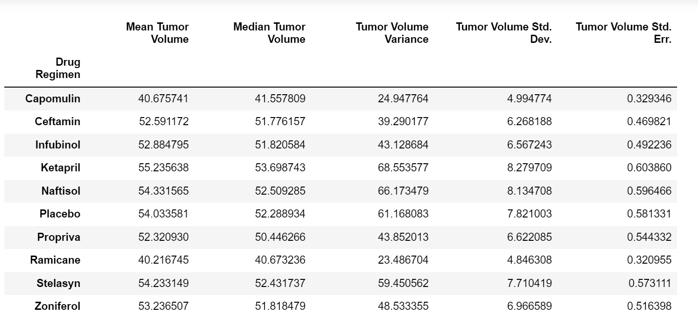
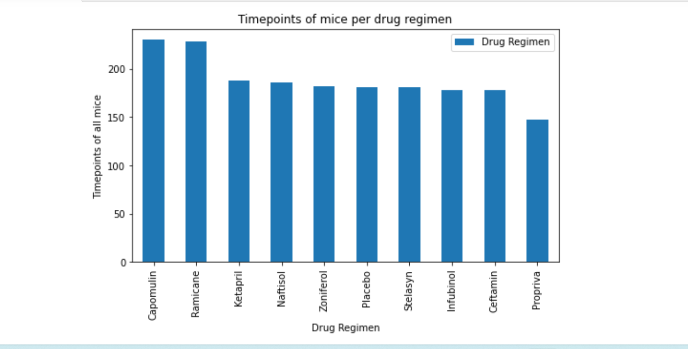
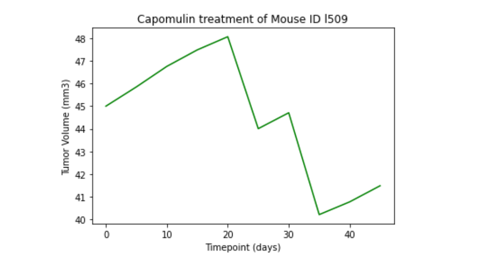
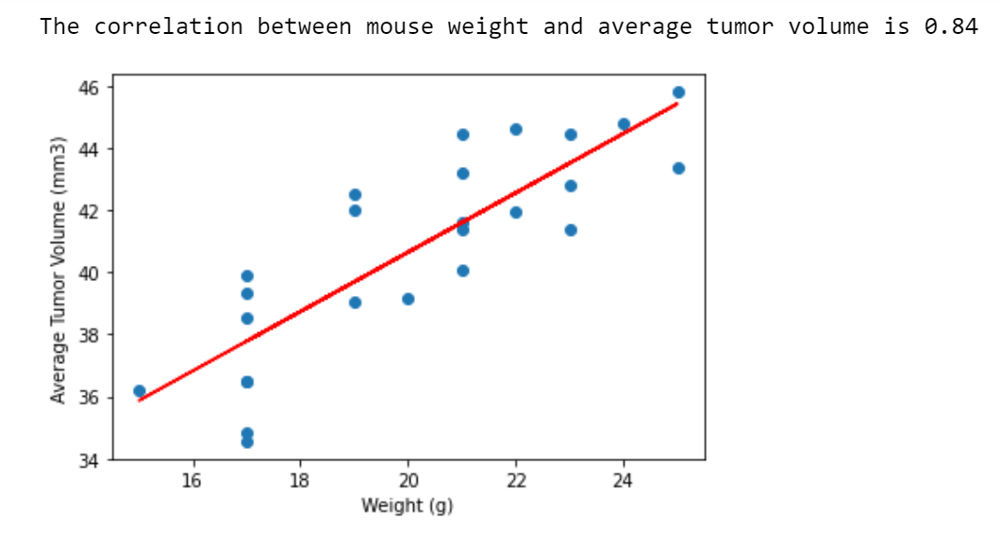
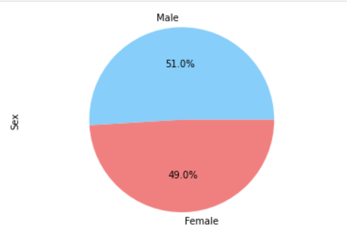

# Pymaceuticals-Matplotlib-Challenge

Matplotlib is a plotting library used in python and pandas. It is a comprehension library that we can use to make and create different plots, charts and make better visualizations in pandas. In this assignment, we've been tasked to compare the performance of Pymaceuticals' drug of interest, Capomulin, versus the other treatment regimens in a  pharmaceutical company i.e. Pymaceuticals Inc. This company  specializes in anti-cancer pharmaceuticals. Recently, it began screening for potential treatments for squamous cell carcinoma (SCC), a commonly occurring form of skin cancer. In this assignment, 249 mice identified with SCC tumor growth were treated with a variety of drug regimens. Over the course of 45 days, tumor development was observed and measured. We've been tasked to generate all of the tables and figures needed for the technical report of the study and also a top-level summary of the study results.

## Instructions
For this assignment, we are tasked to do the following:

* Prepare the data.
     1) Run the provided package dependency and data imports, and then merge the mouse_metadata and study_results DataFrames into a single DataFrame.
     2) Display the number of unique mice IDs in the data, and then check for any mouse ID with duplicate time points. 
     3) Display the data associated with that mouse ID, and then create a new DataFrame where this data is removed. Use this cleaned DataFrame for the remaining step.
     4) Display the updated number of unique mice IDs.

* Generate summary statistics. 

       Create two summary statistics DataFrames:
       1)  For the first table, use the `groupby` method to generate the mean, median, variance, standard deviation, and SEM of the tumor volume for each drug regimen. This should result in five unique series objects. Combine these objects into a single summary statistics DataFrames.
       2)* For the second table, use the `agg` method to produce the same summary statistics table by using a single line of code.

* Create bar charts and pie charts. 

      1) Generate two bar plots. Both plots should be identical and show the total number of timepoints for all mice tested for each drug regimen throughout the course of the study.
      2) Create the first bar plot by using Pandas's DataFrame.plot() method.
      3) Create the second bar plot by using Matplotlib's pyplot methods.
      4) Generate two pie plots. Both plots should be identical and show the distribution of female or male mice in the study.
      5)Create the first pie plot by using both Pandas's DataFrame.plot().
      6)Create the second pie plot by using Matplotlib's pyplot methods.

* Calculate quartiles, find outliers, and create a box plot. 

   1) Calculate the final tumor volume of each mouse across four of the most promising treatment regimens: Capomulin, Ramicane, Infubinol, and Ceftamin. Then, calculate the quartiles and IQR and determine if there are any potential outliers across all four treatment regimens. We need to follow these substeps:
     
     a) Create a grouped DataFrame that shows the last (greatest) time point for each mouse. Merge this grouped DataFrame with the original cleaned DataFrame. 
     b) Create a list that holds the treatment names, as well as a second, empty list to hold the tumor volume data. 
     c) Loop through each drug in the treatment list, locating the rows in the merged DataFrame that correspond to each treatment. Append the resulting final tumor volumes for each drug to the empty list. 
     d) Determine outliers by using the upper and lower bounds, and then print the results.

   2) Using Matplotlib, generate a box plot of the final tumor volume for all four treatment regimens. Highlight any potential outliers in the plot by changing their color and style.  

* Create a line plot and a scatter plot. 

   1) Select a mouse that was treated with Capomulin and generate a line plot of tumor volume vs. time point for that mouse.
   2) Generate a scatter plot of tumor volume versus mouse weight for the Capomulin treatment regimen.

* Calculate correlation and regression. 

   1) Calculate the correlation coefficient and linear regression model between mouse weight and average tumor volume for the Capomulin treatment.
   2) Plot the linear regression model on top of the previous scatter plot

 
## Conclusion/Analysis:

After calculating and plotting all the required data and tables. I've come up with the following conclusions:

   * Observing the summary table above, we can see that the capomulin and ramicane regimen had the best results in reducing the tumor volume as compared to the other drug regimens. All, other statistical values (median, variance, std and sem) were also lower for the capomulin and ramicane regimen as compared to the others. The Ketapril regimen was observed to be the least effective on the tumor and the tumor volume was higher as compared to the volumes under capomulin and ramicane regimens.

   

   * When we look at the bar chart, we can see that Capomulin and ramicane have similar timepoints as compared to the rest of the drug regimen. Propriva has the least number of total timepoints and also number of mice tested on. Majority of the mice were treated with capomulin and ramicane drugs which showed better results in terms of reducing the tumor volume. 

   

   * Looking at the line plot for Capomulin treatment of mouse id l509, we can see that the initial size of the tumor volume is 45 (mm3), after 20 days of treatment it increases to about 48(mm3). The size fluctuates over the course of the next 25 days but in a decreasing manner. After 45 days of treatment, the tumor volume decreases to about 41.5 (mm3). 

   

   * Looking at the Correlation scatter plot, and after calculating the correlation coefficient using pearsonr formula, we can see that there's a strong positive correlation (0f 0.84) between the mouse weight and average tumor volume. A change in the value of mouse weight will predict a change in the same direction in the average tumor volume.

  

   * Looking at the pie plots, we can observe that more male mice were used for the study as compared to female mice.  Further analysis based on the sex, may lead to finding the different effects of potential treatments for squamous cell carcinoma (SCC)on male and female mice.

